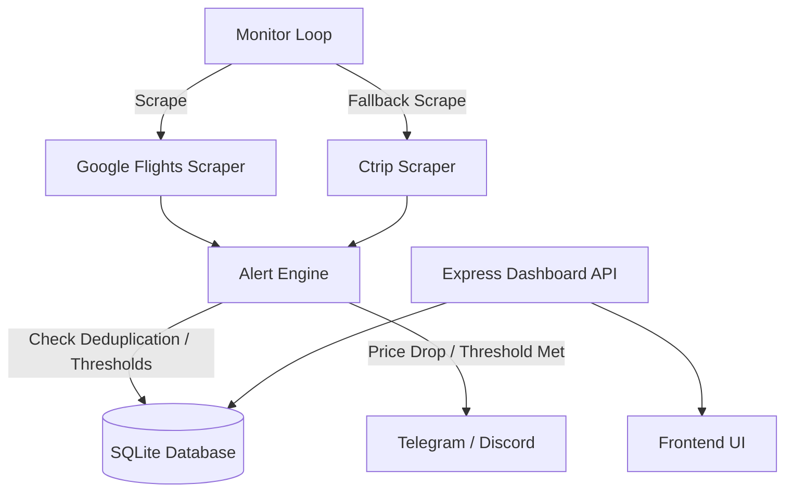

# Shanghai Flight Monitor

A budget traveler tool designed to track and monitor flight prices from Shanghai (PVG/SHA) to various destinations in East Asia, Southeast Asia, and Europe. It automatically scrapes flight prices and sends alerts via Telegram or Discord when prices drop or meet specific thresholds.

## Architecture Diagram



## Prerequisites

- [Node.js](https://nodejs.org/) (v16 or higher recommended)
- Firefox (Playwright requires a browser to run scraping, the project defaults to Firefox)

## Installation

1. Clone the repository:
   ```bash
   git clone <repository_url>
   cd shanghai-flight-monitor
   ```

2. Install dependencies:
   ```bash
   npm install
   ```

3. Install Playwright browsers (Firefox is required):
   ```bash
   npx playwright install firefox
   ```

## Configuration

Create a `.env` file in the root directory and configure the necessary environment variables:

```env
# Server Port (Dashboard)
PORT=3000

# Scrape Interval in Hours
SCRAPE_INTERVAL_HOURS=12

# Database Path (Optional, defaults to database.sqlite in root)
DB_PATH=./database.sqlite

# Telegram Configuration
TELEGRAM_BOT_TOKEN=your_telegram_bot_token
TELEGRAM_CHAT_ID=your_telegram_chat_id

# Discord Configuration
DISCORD_WEBHOOK_URL=your_discord_webhook_url
```

## Usage

### Start the Application

To initialize the database, start the dashboard, and begin the monitoring loop:

```bash
npm start
```

### Development Mode

To run the application with hot-reloading (using nodemon):

```bash
npm run dev
```

### Run Tests

To execute the test suite (Jest):

```bash
npm test
```

## Project Structure

- `src/index.js` - The main entry point, initializes the database, starts the dashboard, and schedules the scraper.
- `src/scraper/` - Contains Playwright-based scraper implementations for Google Flights and Ctrip.
- `src/db/` - SQLite database initialization and schema definitions.
- `src/alerts/` - Logic for checking price thresholds and sending notifications via Discord/Telegram.
- `src/dashboard/` - An Express-based API for viewing monitored routes and price histories.
- `docs/` - Project specifications and design documents.

## License

ISC
