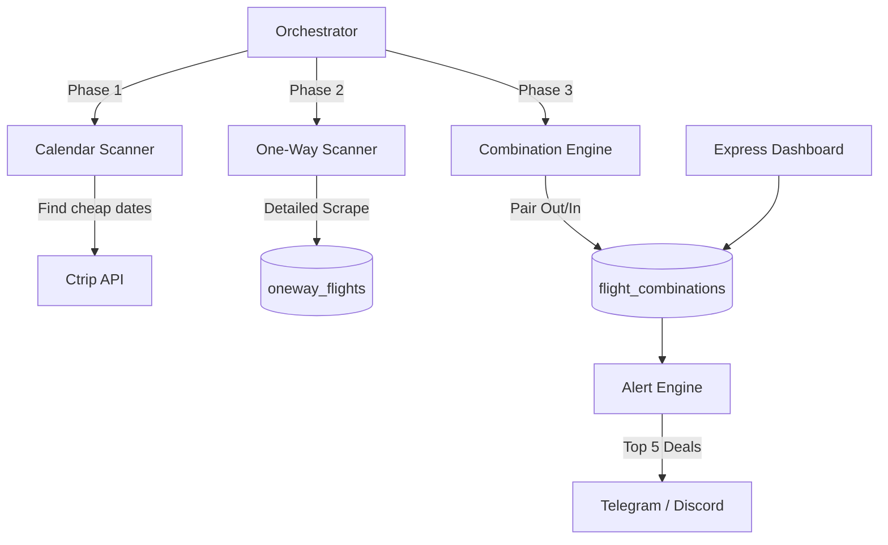

# Shanghai Flight Monitor (Next-Gen)

A high-efficiency one-way scanning and combination engine designed for budget travelers. It monitors 48 direct-flight airports from Shanghai (PVG/SHA) over a 6-month horizon, identifies the cheapest travel dates, and pairs them into optimal round-trip deals.

## 🚀 New Architecture

The system operates in a three-phase scanning pipeline:



## 🛠️ Key Features

- **Massive Coverage**: Automatically monitors 48 curated airports across Asia, Europe, and Oceania.
- **Smart Pairing**: Finds optimal round-trip combinations with a 3-7 day gap.
- **Direct Only**: Focuses strictly on direct flights for maximum travel comfort.
- **Modern Dashboard**: Real-time visualization of scanned flights and top deals with a premium dark-mode UI.

## 📋 Prerequisites

- **Node.js**: v18+ recommended.
- **Playwright**: Installed with the Firefox browser engine.
- **SQLite3**: For local data persistence.

## ⚙️ Installation & Setup

1. **Clone & Install**:
   ```bash
   git clone <repository_url>
   cd shanghai-flight-monitor
   npm install
   npx playwright install firefox
   ```

2. **Configuration**:
   Copy `.env.example` to `.env` and fill in your credentials:
   ```env
   PORT=3000
   TELEGRAM_BOT_TOKEN=...
   TELEGRAM_CHAT_ID=...
   DISCORD_WEBHOOK_URL=...
   DB_PATH=./data/flights.db
   ```

3. **Start Scanning**:
   ```bash
   npm start
   ```

## 📊 Dashboard

Access the dashboard at `http://localhost:3000` to see:
- **Top 5 Deals**: Ranked by total combination price.
- **Scan Status**: Current progress of the 48-airport loop.
- **One-Way Browser**: Recent direct flights found by the scanner.

## 📂 Project Structure

- `src/scanner/` - The core 3-phase scanning engine (Calendar, One-Way, Combinations).
- `src/data/airports.js` - Curated list of monitored international airports.
- `src/alerts/` - Logic for formatting and sending Top Deal notifications.
- `src/dashboard/` - Real-time monitoring UI and API.
- `src/db/` - Database schema and migration logic.

## 🛡️ License

ISC
